I made this, because I used to use
[J.C. Johnson's implementation](https://github.com/jcjohnson/neural-style/)
of
["A Neural Algorithm of Artistic Style"](https://arxiv.org/abs/1508.06576)
by Gatys, Ecker & Bethge and couldn't find a fully functional, easy to use
version of it that doesn't require luatorch. I started from
[https://github.com/gcerar/pytorch-neural-style-transfer](https://github.com/gcerar/pytorch-neural-style-transfer),
because it works with pytorch, but then threw out most of the code
and translated most of jcjohnson's code from luatorch to pytorch,
because I wanted most of the functionality. Eventually I poured it
into a ComfyUI custom node for ease of use.

Because the Neural Style algorithm is optimization based, it takes a
while to run, but it can produce exceptional results and requires
only a single style template. None of the diffusion based image
generation models (like Stable Diffusion) come close for style
transfer, not even with control nets (I'm talking about the base
models, not LoRAs). You would have to try a few combinations of style
image, content image and settings to get a good result, not every
combination works well, so don't give up after the first try. To get
results faster, you can lower the number of iterations and the image
resolution.

I have included several ComfyUI workflows for you to try out. Of
course Neural Style can be combined with other image editing
operations, so be creative. Neural Style can be quite RAM-hungry and
the RAM usage increases proportionally to the number of output
pixels. If your GPU is RAM-starved, try using ADAM instead of L-BFGS
as optimization algorithm and try using tiled operation. By setting
tile_size to any value above 0, the image is processed in square
tiles of that size, limiting RAM usage to a value based on the number
of pixels in that tile. But tiled processing can be much slower, so
only use it if you have RAM troubles.

You need at least one style input, but you can mix up to three styles
together if needed. Optimization starts from the given init_image
(which needs to be the same size as the content image), but if none
is provided, an init_image filled with random noise will be used. The
size of the style image is not important, but larger style images can
provide more fine-grained detail.

If you want a different look, the best options to try are
normalize_gradients and optimizer, they change the output a lot.
Changing the style weight and init_image also have strong influence
on the output. Stylizing grayscale images doesn't work that well
unless you use force_grayscale.

The VGG19 net offered by pytorch is not really usable, because
apparently it has been retrained from scratch. Because I wanted to
make sure that this code produces the same output as jcjohnson's code
(as much as that is possible with pytorch), [this version of
VGG19](https://huggingface.co/spaces/AfrodreamsAI/afrodreams/blob/8970ea4f6cc349d826137af0866565df84f0a0ed/vgg19-d01eb7cb.pth)
is needed. It uses a different input normalization than pytorch's
VGG19 and thus isn't a drop-in replacement. If the file ever
disappears, you might be able to find it again using the Xet hash
f9e4a36f2006749e45f62c5fd3881650b33422d7ffd88548c709b9d7d5d6c825 or
the SHA256 hash
dd893d447ece014ad32d71b8d32b1e0b5c09b912a2866990c286fdeebd368d74 .

To install this, just throw neural_style.py into the custom_nodes
directory and vgg19-d01eb7cb.pth into the base directory (i.e. where
comfyui's main.py lives) and restart ComfyUI. The node is named
NeuralStyle and can be found in the "image" section.

I tested this with ComfyUI commit
0963493a9c3b6565f8537288a0fb90991391ec41 . If it doesn't work with
your ComfyUI installation, try switching to this commit first. I will
eventually test this with different ComfyUI commits, but there are so
many of them, so it will take a while.

Examples
========

A couple of examples of applying this tool using the styles of
Jackson Pollock, Pierre-Auguste Renoir, Leonid Afremov, Wassily
Kandinsky, Robert Delaunay, Ernst Ludwig Kirchner and some others.
Click on them for the full-resolution version:
[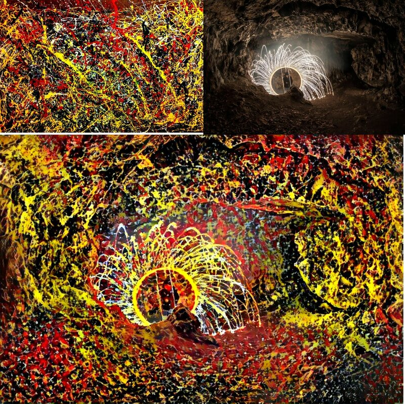](examples/example00.jpg)
[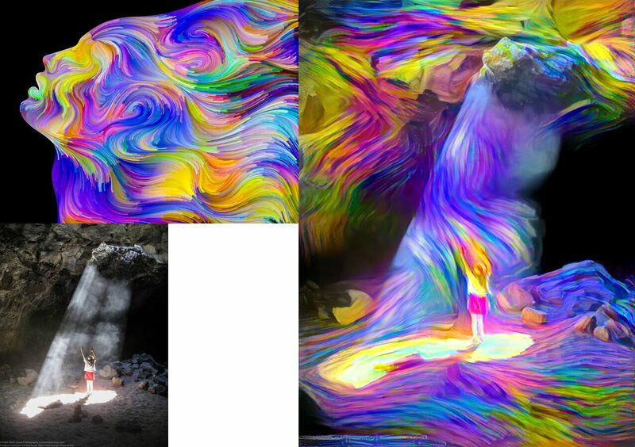](examples/example01.jpg)
[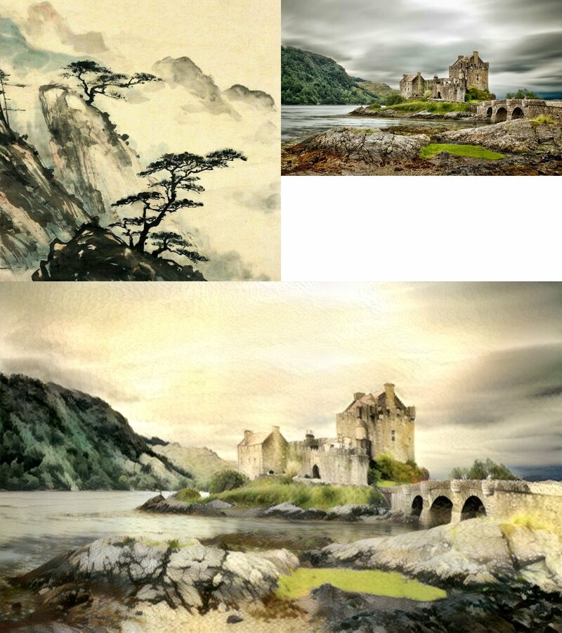](examples/example02.jpg)
[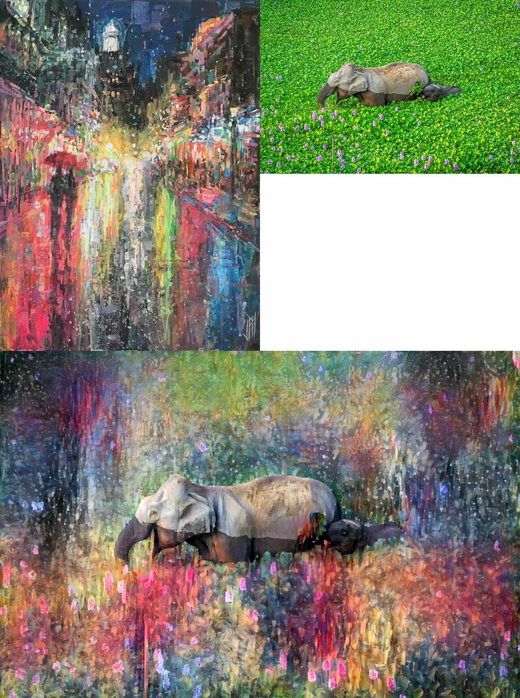](examples/example03.jpg)
[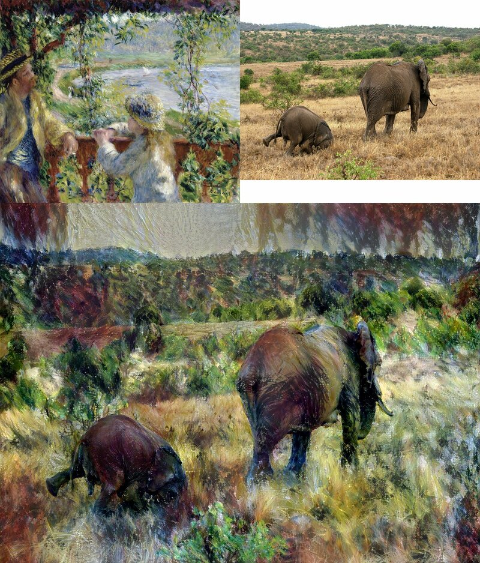](examples/example04.jpg)
[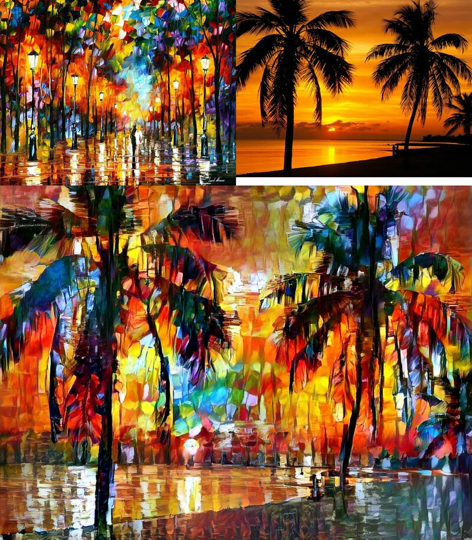](examples/example05.jpg)
[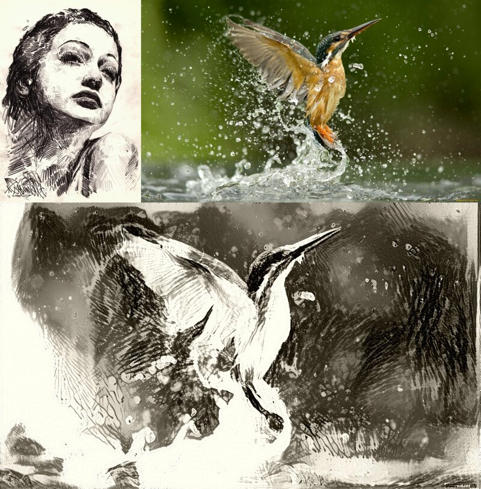](examples/example06.jpg)
[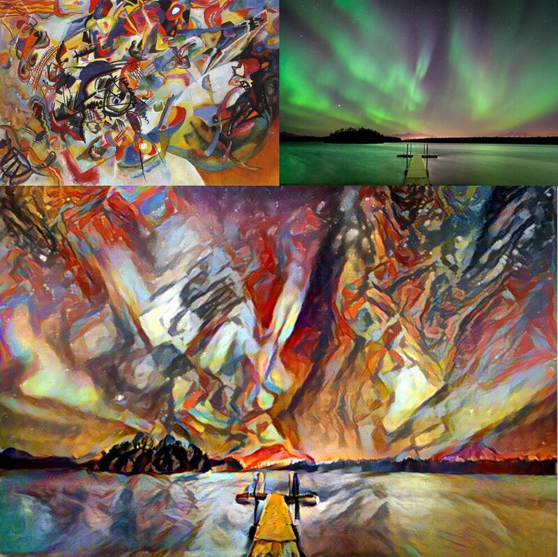](examples/example07.jpg)

[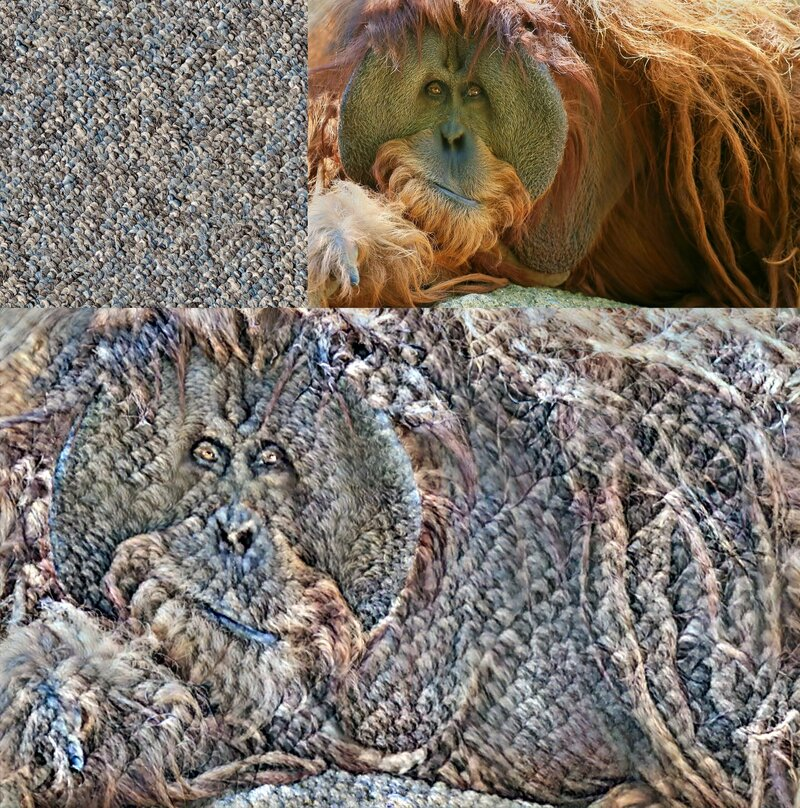](examples/example09.jpg)
[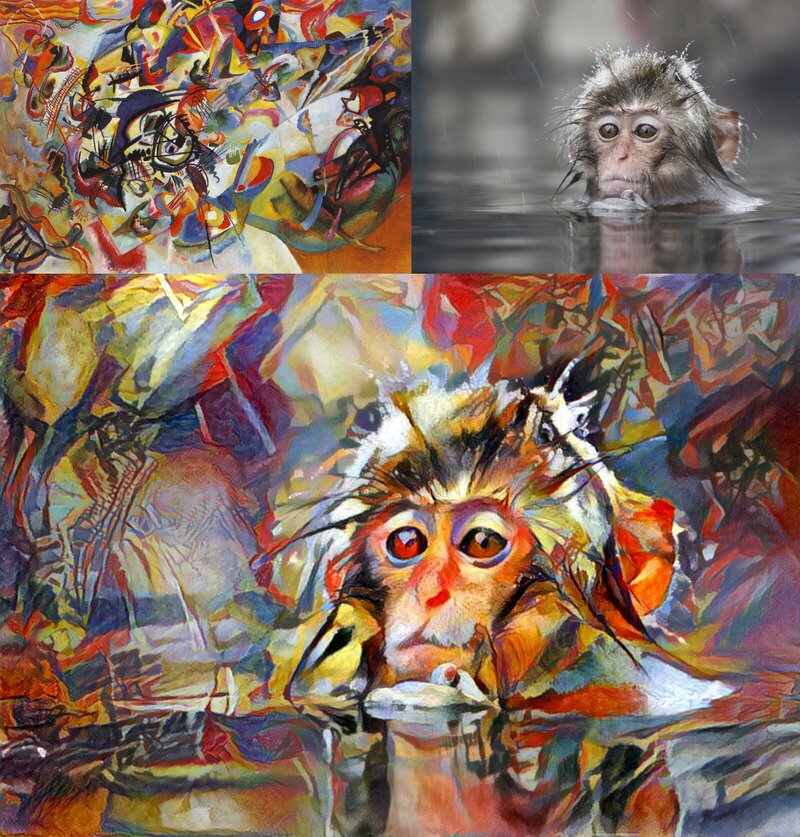](examples/example10.jpg)
[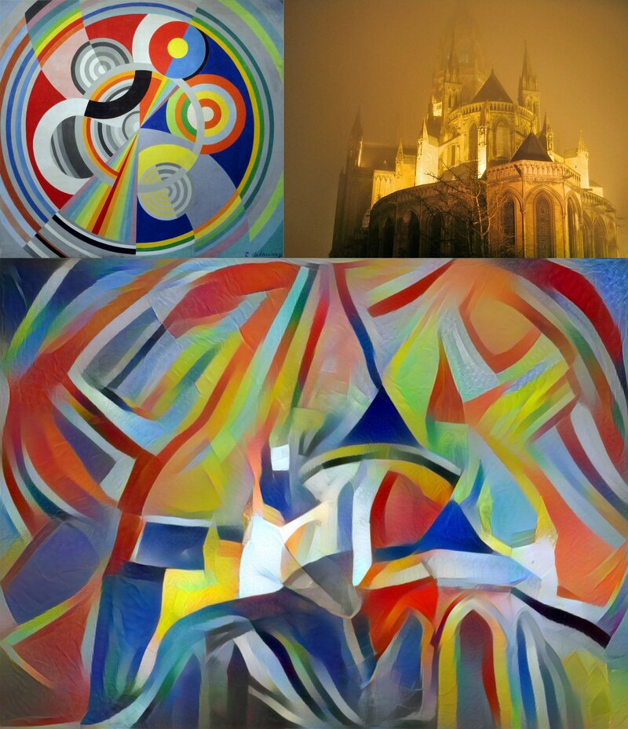](examples/example11.jpg)
[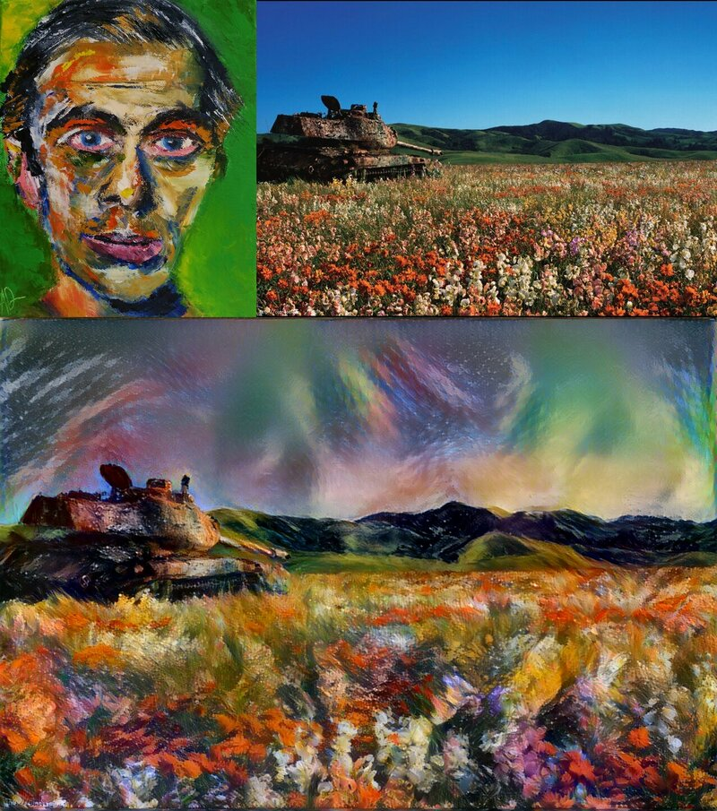](examples/example12.jpg)
